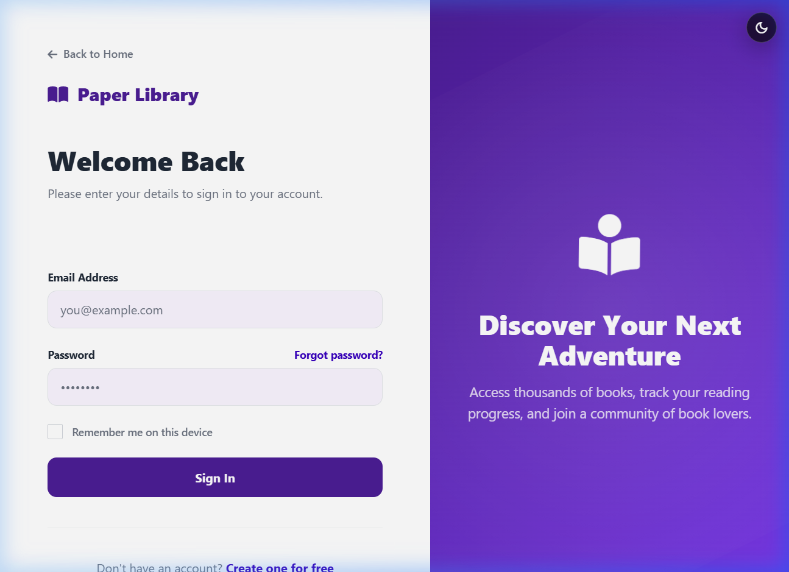
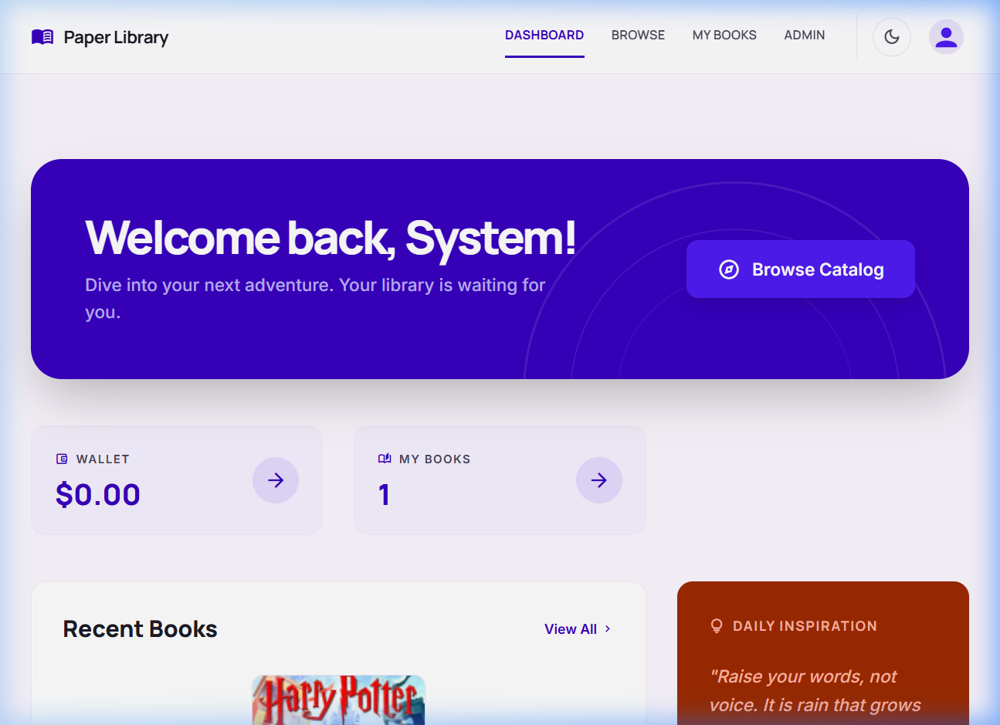
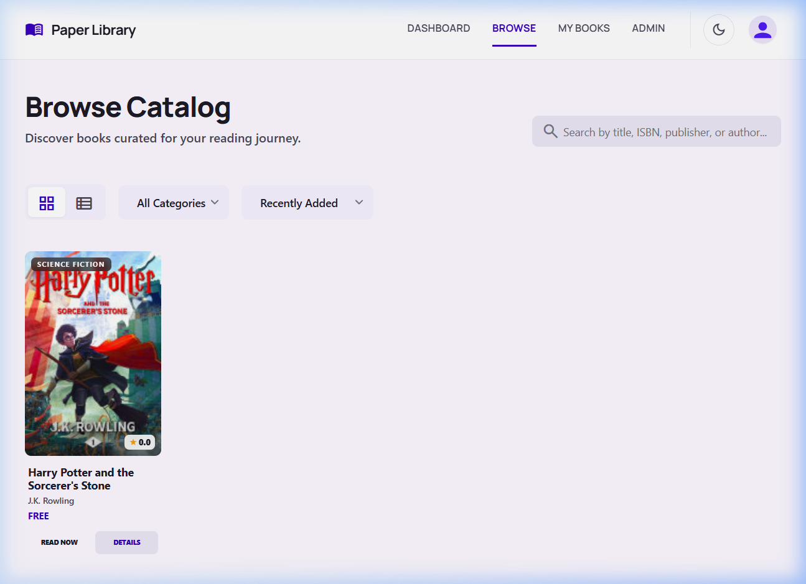
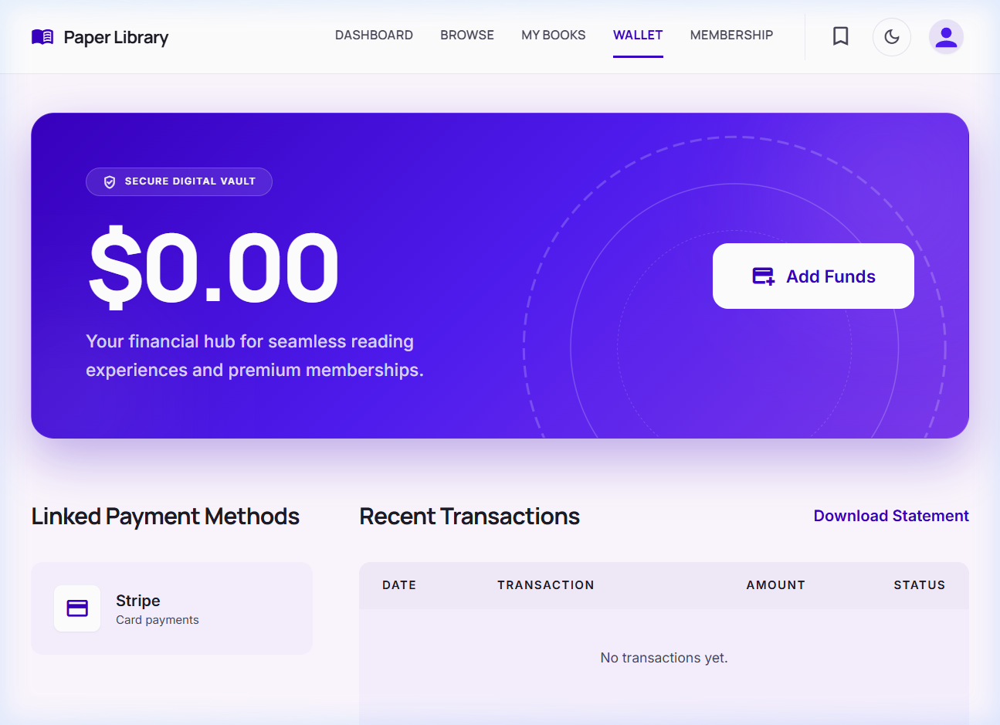
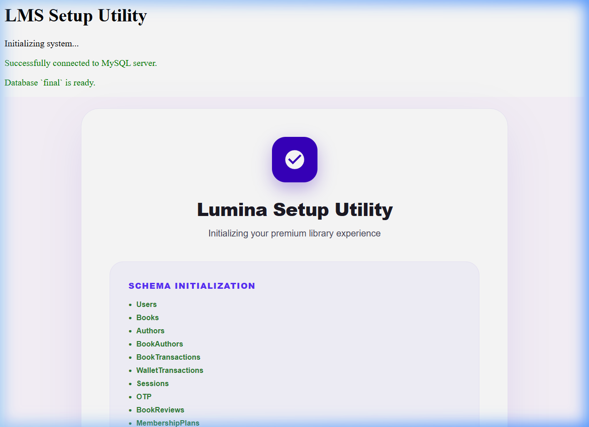

# 📚 Library Management System (PHP + MySQL)

<p align="center">
  
</p>

<p align="center">
  <a href="https://github.com/cushionfalls/Library_management_system"></a>
  
  
  
</p>

---

## 🌟 Overview
This is a robust and modern **PHP (mysqli) + MySQL** Library Management System built for local development on **XAMPP**. It features a comprehensive digital library interface, secure financial transactions via Stripe, and role-based permissions.

### 🔑 Key Features
*   **🔒 Secure Authentication**: User registration and login flow augmented with **email OTP verification**.
*   **👥 Role-Based Access Control (RBAC)**: Distinct permissions for `ADMIN`, `LIBRARIAN`, and `USER` (Students/Readers).
*   **📚 Book Catalog & Rentals**: Book cataloging, transactions/rentals tracking, and automated fine calculation.
*   **💳 Wallet & Stripe Integration**: Direct wallet top-up using **Stripe**, complete transaction logs, and administrative refund systems.
*   **🎟️ Membership Plans**: Readers can subscribe to premium membership tiers using their **wallet balance**.
*   **✨ Magical Book Preloader**: A customized once-per-session CSS/JS loading animation modeled on the magical "Paper Library" aesthetic.

---

## 📸 Interface Showcase

| 🏠 Homepage & Welcome | 🔑 Secure Member Portal |
| :---: | :---: |
|  |  |

| 📊 Administrator Dashboard | 📚 Books & Inventory |
| :---: | :---: |
|  |  |

| 💳 Wallet & Balance History | 🎟️ Membership Subscriptions |
| :---: | :---: |
|  |  |

| ⚙️ One-Click Database Setup |
| :---: |
|  |

---

## 🎟️ Membership Plans
Memberships can be purchased directly at `index.php?page=membership` (login required).

| Plan Duration | Price (USD) | Purchase Method |
| :---: | :---: | :---: |
| **1 Month** | `$4.99` | Wallet Balance |
| **6 Months** | `$15.99` | Wallet Balance |
| **12 Months** | `$35.00` | Wallet Balance |

### 🔄 Subscription Lifecycle
1.  When a membership is purchased, the wallet balance is debited and a transaction log is entered into `WalletTransactions` with the reason **`MEMBERSHIP`**.
2.  The membership plan status upgrades to **ACTIVE** immediately (or adds time to the expiration date if an existing plan is already active).
3.  The membership page displays **Active plan + valid until** date; otherwise, it reports **Not Activated**.

---

## 🏗️ Project Architecture
The codebase follows a structured Model-View-Controller (MVC) style:

```yaml
Library_management_system/
├── index.php                 # App Entrypoint -> delegates to public/index.php
├── setup.php                 # Database builder & database seeding script
├── config/
│   └── config.php            # Database connections, URLs, and API keys
├── public/
│   ├── index.php             # Front controller / router utilizing "?page=..."
│   ├── css/                  # Styling files (styles, dashboard, preloader)
│   ├── js/                   # Front-end request handlers and Stripe integrations
│   └── uploads/              # Uploaded media (book covers, e-books, etc.)
├── classes/
│   ├── Database.php          # Database handler / connection manager
│   ├── Session.php           # User session validations & permissions checks
│   ├── Wallet.php            # Core wallet ledger business logic
│   └── Membership.php        # Subscriptions, duration audits, and plan details
├── controllers/
│   ├── wallet.php            # Wallet actions JSON API (Stripe, statements)
│   └── membership.php        # Membership purchase & retrieval JSON API
└── views/
    ├── dashboard.php         # Admin and reader dashboards
    ├── books.php             # Catalog browser and catalog editors
    ├── wallet.php            # Balance manager & transaction history GUI
    ├── membership.php        # Plan selectors and active plan counters
    └── preloader.php         # Magical Book preloader animation markup
```

---

## 🛠️ Local Installation & Setup

### Requirements
*   **XAMPP** (Apache server & MySQL server)
*   **PHP 7.4+** with `mysqli` extension active

### Installation Steps

1.  **Clone the Repository**
    ```bash
    git clone https://github.com/cushionfalls/Library_management_system.git
    cd Library_management_system
    ```

2.  **Configure Environment Details**
    Open `config/config.php` and update configuration parameters:
    *   Set `DB_HOST`, `DB_USER`, `DB_PASS`, `DB_NAME`, and `DB_PORT` for your MySQL service.
    *   Verify `APP_URL` matches your local XAMPP setup (default: `http://localhost/library_management_system`).

3.  **Run Database Migrations**
    Open your browser and navigate to the database setup script:
    ```
    http://localhost/library_management_system/setup.php
    ```
    This script automatically reads `db.sql`, sets up the database schema, builds all necessary tables, and seeds the system with default values.

4.  **Log In to System**
    Use the seeded administrator account created during setup:
    *   **Email:** `admin@librarymanagement.com`
    *   **Password:** `admin123`

---

## 🔗 Navigation Routing & Core APIs

### Key Page Routes
*   `index.php?page=home` - Public Landing & Features Overview
*   `index.php?page=login` - Security Gateway
*   `index.php?page=dashboard` - Main control hub (Protected)
*   `index.php?page=books` - Digital Book Catalog (Protected)
*   `index.php?page=wallet` - Wallet Recharge & History (Protected)
*   `index.php?page=membership` - Subscription Tiers (Protected)

---

### Core JSON APIs (`controllers/`)

#### 💳 Wallet API (`controllers/wallet.php`)
*   `GET  ?action=getBalance` — Returns the current logged-in user balance.
*   `GET  ?action=getTransactions&limit=20&offset=0` — Fetches user-specific transaction histories.
*   `POST ?action=stripe-create-intent` (params: amount) — Handshakes with Stripe to generate client secrets.
*   `POST ?action=stripe-finalize` (params: payment_intent) — Audits payment confirmation and registers user credits.
*   `GET  ?action=downloadStatement` — Compiles and serves transaction history as a downloadable CSV.

#### 🎟️ Membership API (`controllers/membership.php`)
*   `GET  ?action=getPlans` — Retrieves all configured membership plans.
*   `GET  ?action=getStatus` — Pulls subscription states (expiration dates, tier information).
*   `GET  ?action=getHistory` — Fetches billing logs for active memberships.
*   `POST ?action=purchase` (params: plan_id) — Processes purchases, subtracts balances, and upgrades accounts.

---

## 🗄️ Database Architecture
The system database contains the following tables:

*   **Core Systems:**
    *   `Users` — Access logs, contact cards, and account permissions.
    *   `Books` & `Authors` — Book metadata, inventory totals, and references.
    *   `BookTransactions` — Issue histories, return tracking, and fine audits.
    *   `WalletTransactions` — Audit logs of Stripe additions and membership debits.
    *   `OTP` — Short-term tokens utilized for secure multi-factor authentication.

*   **Membership Core:**
    *   `MembershipPlans` — Configurations for available subscriptions.
    *   `UserMemberships` — Live indicators linking users to active subscription terms.
    *   `MembershipPurchases` — Transaction historical receipts mapping membership payments.

---

## ⚠️ Notes & Security
*   **Do not commit configurations with credentials.** Keep your database password, SMTP credentials, and Stripe Private API Keys in `config/config.php` secure and excluded from version control.

---

## 🔍 Troubleshooting
*   **Blank Screen / Navigation Loops:** Verify the `APP_URL` setting inside `config/config.php` matches the active subfolder name located in Apache's `htdocs` directory.
*   **Database Schema Failures:** Verify the MySQL daemon is running inside your XAMPP Control Panel and verify details (such as usernames/ports) in `config/config.php` before loading `setup.php`.
